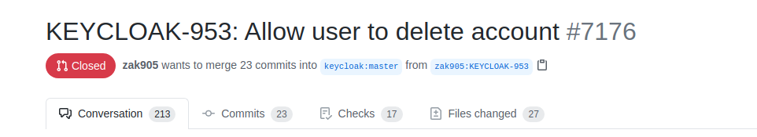
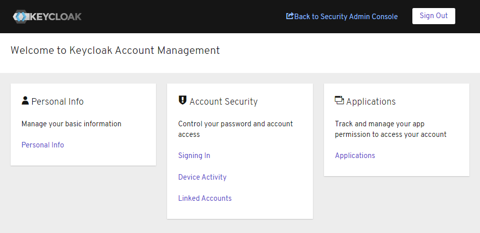
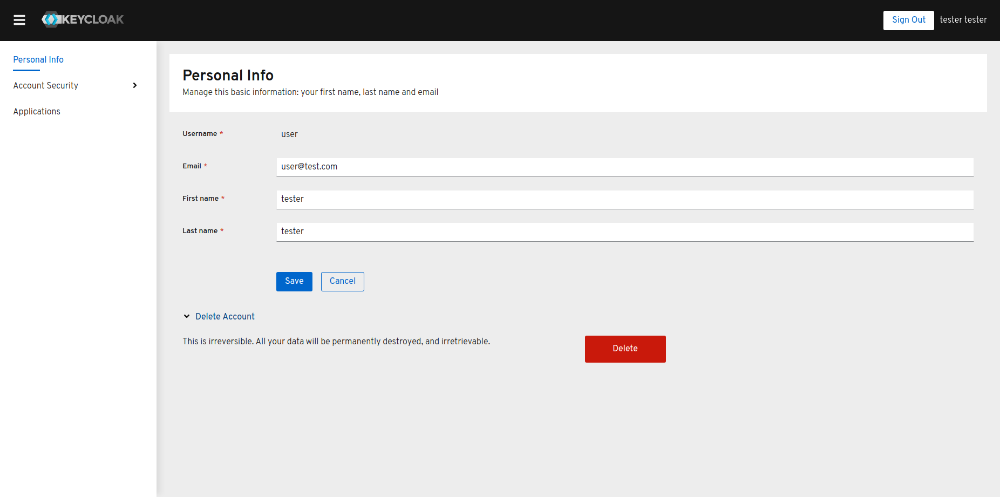
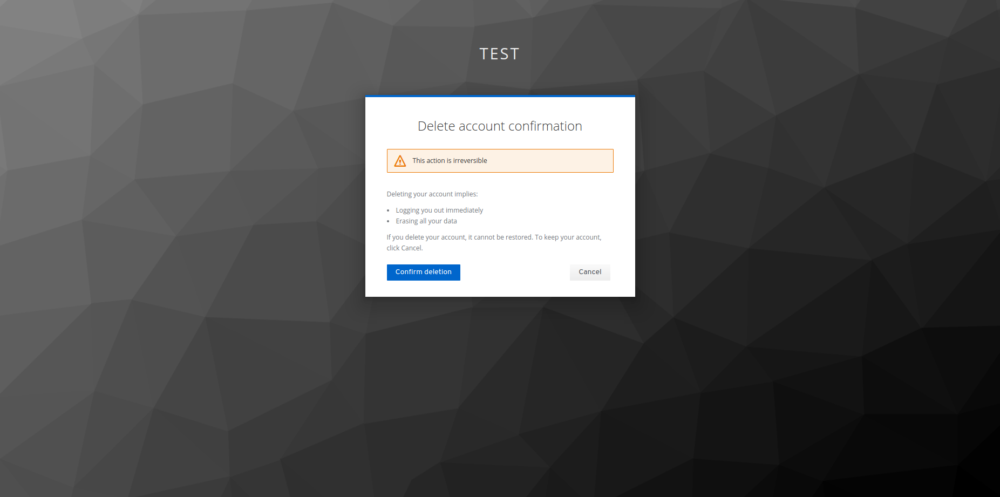

After working on this feature for over 1 year and half, I finally got the approval of Keycloak's team for merging the famous   [KEYCLOAK-953](https://issues.redhat.com/browse/KEYCLOAK-953). As the title of the ticket implies, the feature's goal is to allow application end users (not Keycloak admin) to delete their account through the account console. This is a de facto functionality that is provided by most applications nowadays. It is also important when confronted with laws that organize data protection such as [GDPR](https://en.wikipedia.org/wiki/General_Data_Protection_Regulation). The "delete user" feature is not be active by default, and requires some set up from the Keycloak admin. I am glad that after 1 rejected PR, almost 6 months of code review,  tons of discussion with many of the Keycloak's project main contributors, this feature finally went throught. I hope the community will find it useful. More details can be found on the PR: [https://github.com/keycloak/keycloak/pull/7176](https://github.com/keycloak/keycloak/pull/7176)

# A walk through the feature:

First of all, it's worth mentionning that the feature is not yet released as of the time this is written, it will be part of next Keycloak release, the 12.x.x release probably. 

After long discussions with the Keycloak team, we figured that since the classic account console is planned to be deprecated, it makes sens to have this feature on the new account console, which was released starting from version 11.0.2. More details can be found on this [announcement](https://www.keycloak.org/2020/09/new-account-console.adoc.html#:~:text=New%20Account%20Console%20is%20the,instead%20of%20the%20old%20one.).

The functionality is provided through an AIA (application initiated action), so you will find a new action called "Delete Account" in the "Required Actions" page. 

To activate the feature, the Keycloak admin needs to:

   - activate the "Delete Account" required action (which is disabled by default)
   - add the "delete-account" role to the "account-console" client for the user (client role)

As per the recommendations of the Keycloak team, the feature needs to be activated on a per user basis; however, it's always possible to use groups, to gather users that have this functionality activated, and to avoid having to repeat the process for every user. Once activated, the "Delete Account" section will appear in the bottom of the "Personal info" page. 

Once the user clicks the delete button, he will be asked to re-authenticate, and then to confirm the account deletion:

Since Keycloak is highly customizable, it will be off course possible to customize the location and look and and feel of the delete account section.

Once the feature will be released, there will be also a detailed documentation entry. Until then, stay tuned!