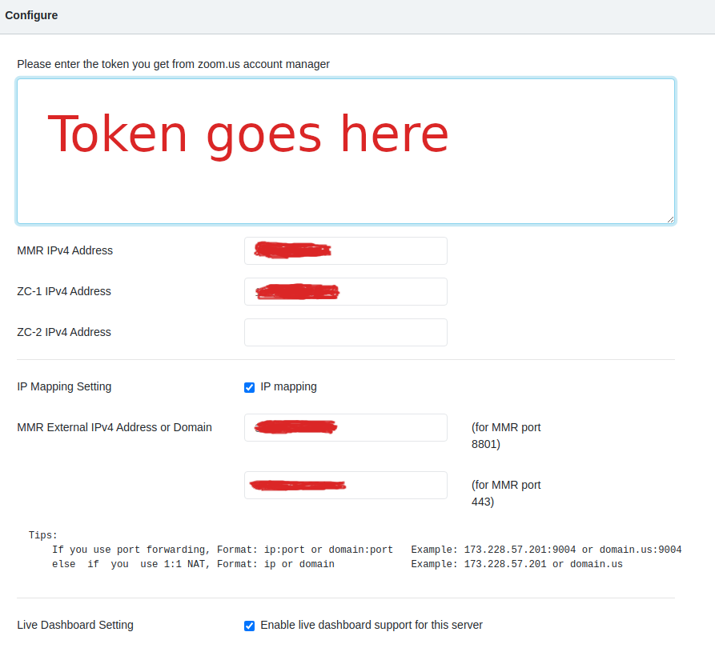
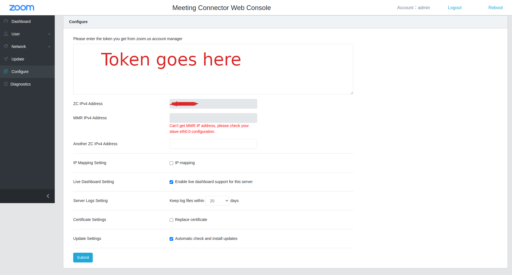

I participated lately in a project with a requirement to deploy [Zoom](https://zoom.us/) (the famous meetings company) on premise VMs on AWS. It seemed easy, at first glance, since Zoom offers VMs to download in `vmdk` format and AWS supports the conversion of `vmdk` to `AMIs` that can be used as the basis for creating an EC2 instance. The challenging part was that the Zoom VMs are meant for virtualization platforms [^1] like VMWare or VirtualBox. Things worked slighlty different on AWS. With this being said, I would like to point out that I am not quiet sure whether the on premise functionality is available for Zoom free plans. Also, I am not doing any form of advertisement or review for Zoom products. I just wanted to share some few tips that lead me to configure this successfully on AWS, hoping that this would be helpful to some fellow developer someday. 

# What is Zoom on premise and what is it meant for

Zoom offers several ways for recording a meeting: local or cloud. With the cloud approach, the meetings are recorded and stored directly in the Zoom cloud, which can be an issue when companies have security policies dealing with privacy or data governance. For example, one would expect that a company in China would not be happy about their meetings data stored in the Zoom cloud in the US. Zoom on-premise is one way to deal with data privacy and governance when using Zoom meetings software. It allows companies/users to host the whole infrastucture used to process and record meetings on premise. All what a user needs to do is to download the VMs offered by Zoom, and to follow the configuration instructions: [https://support.zoom.us/hc/en-us/articles/201363093-Deploying-the-Meeting-Connector](https://support.zoom.us/hc/en-us/articles/
201363093-Deploying-the-Meeting-Connector)


# Caveat 1: sshd is not enabled in all VMS

After testing the VMs locally on VirtualBox, I realized that all the VMs have sshd disabled, and since this would be the only way accessing the VMs on AWS, I had to enable the sshd using `systemctl enable sshd` and then re-export them using `VBoxMange export` command. 

# Caveat 2: the upload to AWS

To be able to run VMs as EC2 intances, the first step is to upload them to S3 before converting them to AMIs. For people like me with limited internet upload bandwidth, the upload of a 2Gb VM three times can take ages and may never get there. To make things quicker, I used a [Digital Ocean](https://www.digitalocean.com/) droplet as the playground. Based on a test I did using [speedtest-cli](https://github.com/sivel/speedtest-cli), the upload speed can reach up to 200 Mbit/s from a DO droplet. I downloaded all the VMs directly into the droplet (the cookies need to be part of the http request, because the request is authenticated, `curl --cookie` did the trick for me), and then uploaded them to S3 in couple of minutes after doing the `VBoxManage` trick mentionned in Caveat #1.

# Caveat 3: initial root password is generated dynamically

Once the VMs were properly imported as AMIs, I created one EC2 instance out of each VM, and because the first time access password is generated dynamically for each VM, I needed a way to reach the standard output of the VMs to be able get the intial password. The trick was to go Actions -> Monitor and Troubleshoot -> Get system logs from the Actions Menu (in the main EC2 page). This was enough to get the username / password from the system logs to be able to login both from ssh and the configuration web interface (which also uses the OS user for login). 

# Caveat 4: setting up networking needs some manual configuration in AWS

This was hardest part. The configuration of the software installed in the VMs is relatively simple. All you need to do is to enter the token obtained from the Zoom admin and also the ip addresses of ZC (the zone controller) in each one of them. In order to provide on-premise recording functionality, there are three VMs that need to collaborate: The ZC, the MMR, and the Recorder. The MMR and recorder need just the ip (both private and public configuration) in addition to the token 



The ZC however requires a second private ip (by design, not sure about the real reasons) which is by default configured by a slave network interface named `eth0:0`. When run on some virtualization software, the VMs would automatically configure the `eth0:0` interface with a second private IP. However, for some reason the interface creation was blocked on AWS and I got a message like `Can't get the MMR address, please check your slave eth0:0 configuration` when starting the web interface: 

{:style="height:400px"}


After couple of checks, it looked like a network interface named `eth0:0` was indeed not present. So I had to go through the following steps after a lot of back and forth and trial and error: 

1. create the interface manually after ssh-ing into the machine. The VMs provided by Zoom use Centos Linux, and in order to create a new interface, an interface configuration file needs to be created under `/etc/sysconfig/network-scripts`, more details can be found in the Red Hat [docs](https://access.redhat.com/documentation/en-us/red_hat_enterprise_linux/6/html/deployment_guide/s1-networkscripts-interfaces). The interface configuration can contain different directives required to control and launch the network interface. Here is an example of the one I used to create the interface 
    ```
    DEVICE=eth0:0
    BOOTPROTO=static
    ONBOOT=yes
    IPADDR=${IP}
    NETMASK=255.255.255.0
    SLAVE=yes
    MASTER=eth0
    GATEWAY=${THE_GATEWAY_IP}
    DNS1=${THE_DNS_IP}
    NM_CONTROLLED="no"
    ```
    ${IP} can be substited by a private available IP, e.g adding one to the last digit of the `eth0` master interface address

    ${THE_GATEWAY_IP} can be obtained by running the command `ip route show`

    ${THE_DNS_IP} can be found in /etc/resolv.conf

2. Restarting the networking daemon so that the interface is created: `systemctl restart network` (`reload` could work as well, but I have not tried)
   
3.  Going to the network interfaces sub menu in AWS EC2 and associating the `eth0:0` address with the EC2 instance network interface as a second ip address. Checkout the [AWS docs](https://docs.aws.amazon.com/AWSEC2/latest/UserGuide/MultipleIP.html) for more details
   
4. creating an elastic ip address from EC2 `Elastic IPs` sub menu and asssociating it with the `eth0:0` IP address


and there we go, now the Zoom software would be able to detect the `eth0:0` and configure itself properly to connect to Zoom servers for getting meeting infos.  


# Caveat 5: the confID is such a bummer

After zoom recordings are done [^2], they are saved under /opt/zoom/cmr-storage/replay/{year}/{month}/{date}/{meetingID}/{confID} path. While {year}, {month}, {date}, and {meetingID} are predictable, the {confID} is random which makes it difficult to predict the exact path of the recordings if you want to set up some automation after receiving zoom webhooks. After trying different things, I found out that using `inotify` was a good solution for my use case. `inotify` constantly watches over a particular path and triggers events when something changes. I ended up creating a service out of the following script:



inotifywait -m -r -e close_nowrite \
   /opt/zoom/cmr-storage/replay/ |
while read dir op file
do
if [[ "${file}" == *.m4a ]]; then

#upload logic goes here
     
fi
done




References:

[^1]: https://support.zoom.us/hc/en-us/articles/201363113-Meeting-Connector-Core-Concepts

[^2]: https://support.zoom.us/hc/en-us/articles/204757929-Deploying-the-Recording-Connector


